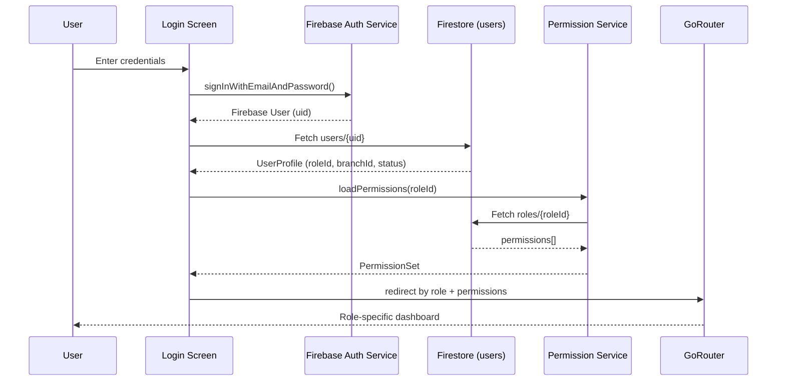
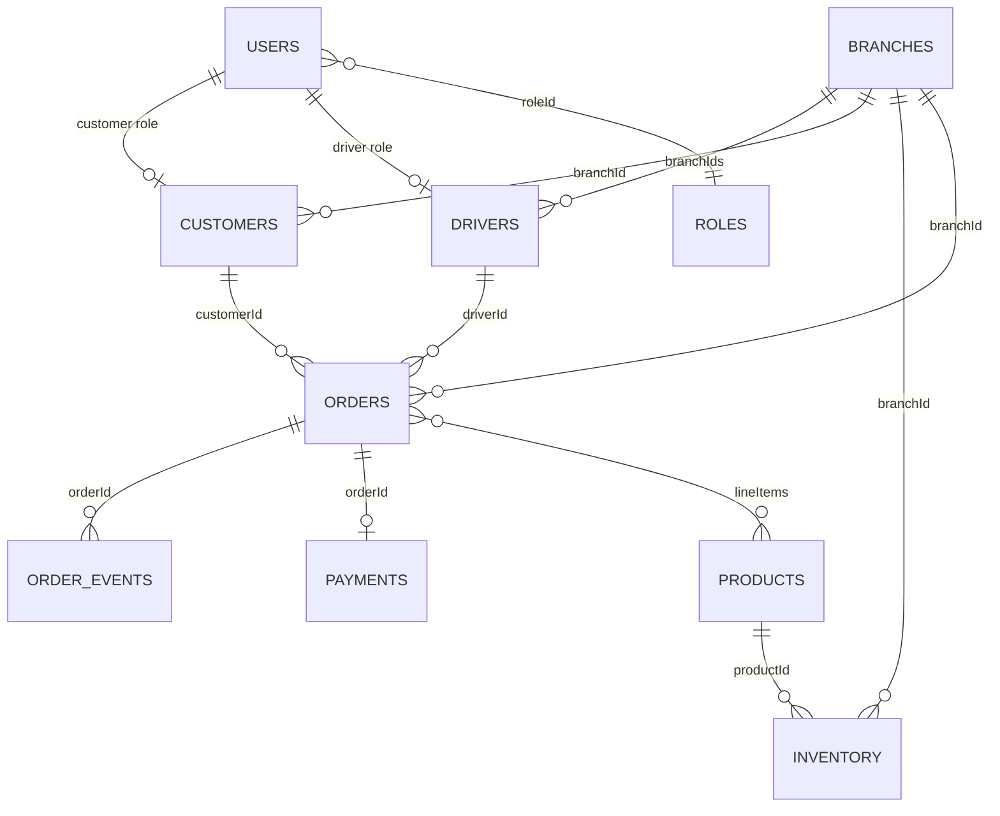
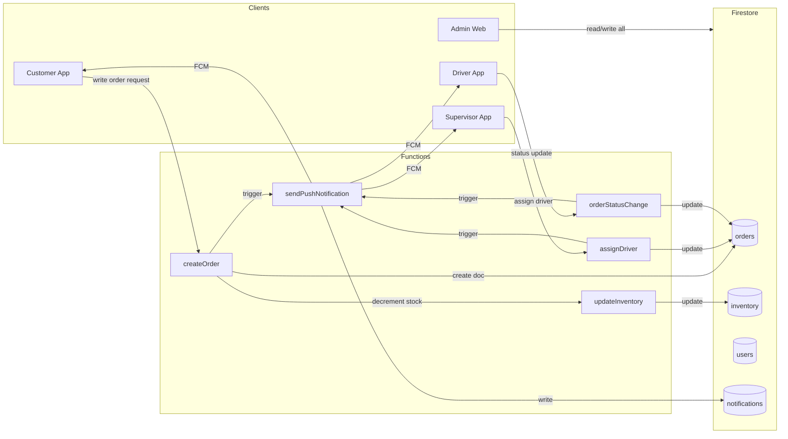
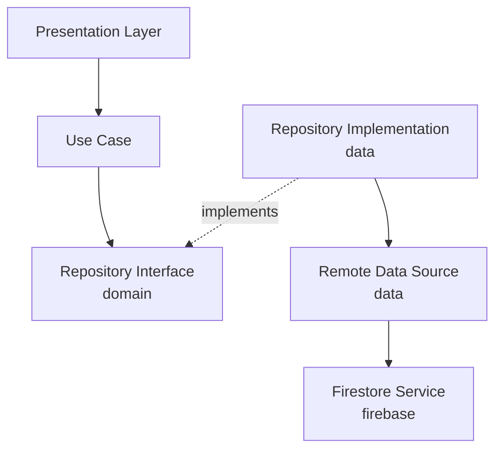
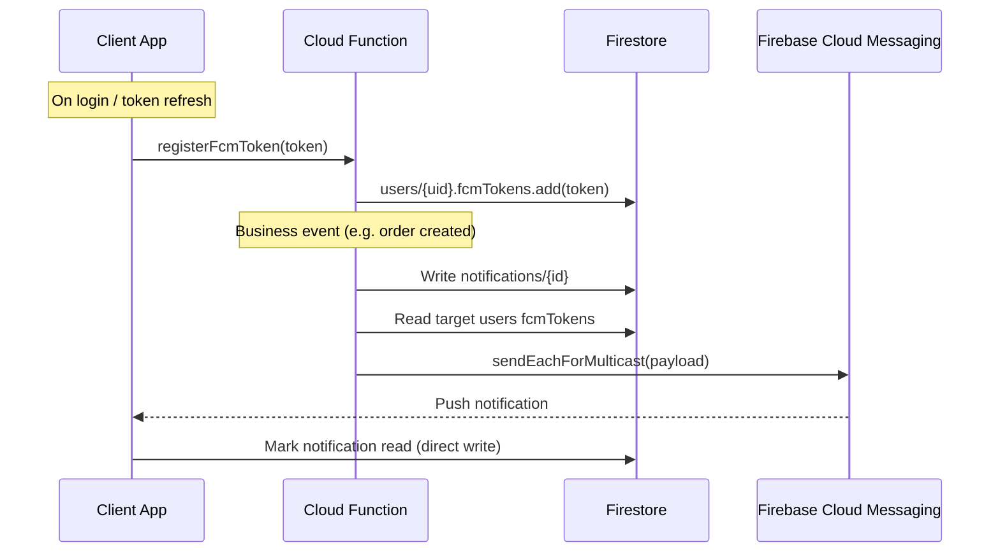

# Water Delivery Management System — Architecture

Production-ready architecture for a multi-app Flutter + Firebase monorepo following Clean Architecture, role-based access control, and server-driven workflows.

---

## Table of Contents

1. [Executive Summary](#1-executive-summary)
2. [Monorepo Overview](#2-monorepo-overview)
3. [Authentication & RBAC](#3-authentication--rbac)
4. [Firestore Database Design](#4-firestore-database-design)
5. [Flutter Clean Architecture](#5-flutter-clean-architecture)
6. [Firebase Layer](#6-firebase-layer)
7. [Cloud Functions Architecture](#7-cloud-functions-architecture)
8. [Push Notifications](#8-push-notifications)
9. [Routing (GoRouter)](#9-routing-gorouter)
10. [Dependency Injection](#10-dependency-injection)
11. [State Management](#11-state-management)
12. [Error Handling](#12-error-handling)
13. [Logging](#13-logging)
14. [Environment Configuration](#14-environment-configuration)
15. [Security](#15-security)
16. [Admin Web Architecture](#16-admin-web-architecture)
17. [Scalability Strategy](#17-scalability-strategy)
18. [Recommended Packages](#18-recommended-packages)
19. [Naming Conventions](#19-naming-conventions)
20. [Best Practices](#20-best-practices)
21. [Performance Recommendations](#21-performance-recommendations)
22. [Future Improvements](#22-future-improvements)

---

## 1. Executive Summary

| Dimension | Decision |
|-----------|----------|
| Repository | Single monorepo with Melos workspace |
| Apps | 4 Flutter targets (3 mobile + 1 web) |
| Architecture | Clean Architecture (domain → data → presentation) |
| State | Riverpod (UI + business state separation) |
| DI | Riverpod providers (compile-safe, testable) |
| Auth | Firebase Auth + Firestore profile + dynamic RBAC |
| Data | Firestore (source of truth, no offline) |
| Backend logic | Cloud Functions v2 (TypeScript) |
| Routing | GoRouter with auth/role guards |
| Environments | 3 Firebase projects (dev / staging / prod) |

**Scale targets:** 10,000 users · 50 branches · 10,000+ orders/day without structural changes.

---

## 2. Monorepo Overview

### 2.1 Top-Level Structure

```
water_delivery/
├── apps/
│   ├── customer_app/          # Flutter mobile — customers
│   ├── driver_app/            # Flutter mobile — drivers
│   ├── supervisor_app/        # Flutter mobile — branch supervisors
│   └── admin_web/             # Flutter web — global admin
│
├── packages/
│   ├── core/                  # Cross-cutting: errors, logging, utils, constants
│   ├── domain/                # Entities, repository contracts, use cases
│   ├── data/                  # Repository implementations, DTOs, mappers
│   ├── firebase/              # Firebase SDK wrappers & services
│   ├── auth/                  # Auth flow, session, RBAC
│   ├── routing/               # GoRouter config, guards, deep links
│   ├── ui_kit/                # Material 3 theme, shared widgets
│   └── notifications/         # FCM client, local notification display
│
├── functions/                 # Cloud Functions v2 (TypeScript)
├── firebase/                  # Rules, indexes, hosting, emulators config
├── docs/                      # Architecture & ADRs
├── tools/                     # Scripts, codegen, CI helpers
├── melos.yaml
├── analysis_options.yaml      # Shared lint rules
└── README.md
```

### 2.2 Why Monorepo + Melos

- **Code sharing:** Domain models, repositories, Firebase layer, and UI kit are shared across all 4 apps.
- **Atomic changes:** A schema change updates functions, rules, and all clients in one PR.
- **Melos:** Standard Flutter monorepo tool — runs `pub get`, `build_runner`, tests, and analysis across packages.

### 2.3 App Boundaries

Each app is a thin shell:

```
apps/customer_app/lib/
├── main.dart                  # Bootstrap, flavor, ProviderScope
├── app.dart                   # MaterialApp.router
├── di/                        # App-specific provider overrides (if any)
└── config/                    # App name, icons, feature flags
```

All business logic lives in `packages/`. Apps only wire dependencies and app-specific routing entry points.

---

## 3. Authentication & RBAC

### 3.1 Authentication Flow



### 3.2 Role Model (Not Hardcoded)

Roles and permissions are **data-driven** in Firestore, not hardcoded in client code.

```
roles/{roleId}
  name: "driver"
  displayName: "Driver"
  permissions: ["orders.read.assigned", "orders.update.status", ...]
  isSystem: true          # Cannot be deleted
  createdAt, updatedAt

permissions/{permissionId}   # Optional registry for admin UI
  id: "orders.read.assigned"
  resource: "orders"
  action: "read"
  scope: "assigned"
  description: "Read orders assigned to self"
```

**System roles** (seeded via Cloud Functions on project init):

| roleId | App Target |
|--------|------------|
| `customer` | customer_app |
| `driver` | driver_app |
| `supervisor` | supervisor_app |
| `admin` | admin_web |

Custom roles (e.g. `branch_manager`, `accountant`) can be added by admins without app redeployment.

### 3.3 User Profile Document

```
users/{uid}                    # uid = Firebase Auth UID
  email: string
  displayName: string
  phone: string?
  roleId: string               # → roles/{roleId}
  branchIds: string[]          # Empty for customer/admin; 1+ for supervisor/driver
  primaryBranchId: string?     # Default branch context
  status: "active" | "suspended" | "pending"
  fcmTokens: string[]         # Managed server-side via Functions
  metadata: map
  createdAt: timestamp
  updatedAt: timestamp
  lastLoginAt: timestamp
```

### 3.4 Client-Side Permission Check

```dart
// Pseudocode — NOT implementation
class PermissionGuard {
  bool can(String permission) => _permissions.contains(permission);
  bool canAny(List<String> permissions) => permissions.any(can);
  bool canAll(List<String> permissions) => permissions.every(can);
}
```

**Rule:** Client checks are for **UX only** (hide buttons, route guards). **Firestore Security Rules + Cloud Functions** enforce authorization.

### 3.5 Session Management

| Concern | Owner |
|---------|-------|
| Auth token refresh | Firebase Auth SDK (automatic) |
| Profile + permissions cache | `UserSessionProvider` (Riverpod) |
| Token invalidation on role change | Cloud Function `onUserRoleChange` → force token refresh via custom claims |
| Logout | Clear providers, revoke FCM token, `signOut()` |

**Custom Claims (recommended):** Cloud Functions set `roleId`, `branchIds`, and `permissions` hash on the Firebase Auth token. Security Rules read `request.auth.token.roleId` for fast rule evaluation without extra Firestore reads.

---

## 4. Firestore Database Design

See [firestore-schema.md](./firestore-schema.md) for full field-level documentation.

### 4.1 Collection Overview

| Collection | Purpose | Access Pattern |
|------------|---------|----------------|
| `users` | Auth-linked profiles | By uid |
| `roles` | RBAC definitions | Read-all (cached) |
| `permissions` | Permission registry | Read-all (cached) |
| `branches` | Physical/logical branches | By branchId |
| `customers` | Customer business profile | By customerId / branchId |
| `drivers` | Driver profile + availability | By branchId, status |
| `orders` | Order lifecycle | By branchId + status + date |
| `order_events` | Immutable audit log | By orderId |
| `products` | Product catalog | By branchId or global |
| `inventory` | Stock per branch | By branchId + productId |
| `inventory_transactions` | Stock movement ledger | By branchId + date |
| `payments` | Payment records | By orderId / customerId |
| `notifications` | In-app notification inbox | By userId |
| `settings` | Global + per-branch config | By scope |
| `fcm_tokens` | Device tokens (optional subcollection) | By userId |
| `reports` | Generated report metadata | By branchId + date |
| `archived_orders` | Cold storage for old orders | By branchId + archivedAt |

### 4.2 Key Relationships



### 4.3 Denormalization Strategy

For 10,000+ orders/day, optimize reads:

| Field | Denormalized On | Reason |
|-------|-----------------|--------|
| `customerName`, `customerPhone` | `orders` | Driver/supervisor list views |
| `driverName` | `orders` | Supervisor dashboard |
| `branchName` | `orders` | Admin cross-branch views |
| `productName`, `sku` | `orders.lineItems[]` | Order detail without product fetch |
| `availableQuantity` | `inventory` | Real-time stock display |

Cloud Functions maintain denormalized fields on source document updates.

### 4.4 Order Document (Core Entity)

```
orders/{orderId}
  orderNumber: string            # Human-readable, e.g. "BR01-20260713-0042"
  branchId: string
  customerId: string
  customerName: string          # denormalized
  customerPhone: string         # denormalized
  driverId: string?
  driverName: string?            # denormalized
  status: OrderStatus            # see enum below
  lineItems: [
    {
      productId: string
      productName: string
      sku: string
      quantity: number
      unitPrice: number
      subtotal: number
    }
  ]
  deliveryAddress: {
    street, city, lat, lng, notes
  }
  scheduledDate: timestamp
  scheduledTimeSlot: string      # "morning" | "afternoon" | "evening"
  pricing: {
    subtotal, deliveryFee, discount, tax, total
  }
  paymentStatus: "pending" | "paid" | "refunded"
  paymentMethod: string?
  notes: string?
  createdAt: timestamp
  updatedAt: timestamp
  assignedAt: timestamp?
  deliveredAt: timestamp?
  cancelledAt: timestamp?
  cancelledBy: string?
  cancelReason: string?
  createdBy: string              # uid
  version: number                # Optimistic concurrency
```

**OrderStatus enum:**
`pending` → `confirmed` → `assigned` → `out_for_delivery` → `delivered` | `cancelled` | `failed`

### 4.5 Indexing Strategy

See `firebase/firestore.indexes.json` (to be created). Key composite indexes:

```
orders:   branchId ASC, status ASC, scheduledDate DESC
orders:   driverId ASC, status ASC, scheduledDate ASC
orders:   customerId ASC, createdAt DESC
orders:   branchId ASC, createdAt DESC
drivers:  branchIds ARRAY_CONTAINS, status ASC
inventory: branchId ASC, productId ASC
payments: customerId ASC, createdAt DESC
notifications: userId ASC, createdAt DESC, read ASC
inventory_transactions: branchId ASC, createdAt DESC
```

**Collection group indexes:** Only if using subcollections (not recommended for orders at this scale — use top-level collections with `branchId`).

### 4.6 Data Flow



---

## 5. Flutter Clean Architecture

See [folder-structure.md](./folder-structure.md) for complete trees.

### 5.1 Layer Responsibilities

```
┌─────────────────────────────────────────────────────┐
│  PRESENTATION (apps + packages/*/presentation)     │
│  Widgets, Screens, Controllers/Notifiers, GoRouter   │
├─────────────────────────────────────────────────────┤
│  DOMAIN (packages/domain)                            │
│  Entities, Repository Interfaces, Use Cases          │
├─────────────────────────────────────────────────────┤
│  DATA (packages/data)                                │
│  Repository Impls, DTOs, Mappers, Data Sources       │
├─────────────────────────────────────────────────────┤
│  FIREBASE (packages/firebase)                        │
│  SDK wrappers — no business logic                    │
└─────────────────────────────────────────────────────┘
```

### 5.2 Dependency Rule

**Dependencies point inward.** Presentation → Domain ← Data → Firebase.

- `domain` has **zero** Firebase/Flutter imports.
- `data` implements `domain` repository interfaces.
- `firebase` is infrastructure consumed by `data`.
- `presentation` depends on `domain` use cases via Riverpod.

### 5.3 Feature Module Structure

Each feature follows the same internal layout (in `packages/domain`, `packages/data`, and app `presentation`):

```
features/orders/
├── domain/
│   ├── entities/order.dart
│   ├── repositories/order_repository.dart
│   └── usecases/
│       ├── create_order.dart
│       ├── get_orders_by_branch.dart
│       └── update_order_status.dart
├── data/
│   ├── models/order_dto.dart
│   ├── mappers/order_mapper.dart
│   ├── datasources/order_remote_datasource.dart
│   └── repositories/order_repository_impl.dart
└── presentation/
    ├── providers/order_providers.dart
    ├── screens/
    ├── widgets/
    └── controllers/order_list_controller.dart
```

### 5.4 Repository Pattern



**Contract example (conceptual):**

```dart
abstract class OrderRepository {
  Future<Result<List<Order>>> getOrdersByBranch(OrderQuery query);
  Future<Result<Order>> getOrderById(String orderId);
  Stream<Result<List<Order>>> watchAssignedOrders(String driverId);
  Future<Result<Order>> createOrder(CreateOrderParams params);
  Future<Result<void>> updateOrderStatus(UpdateStatusParams params);
}
```

- Use cases call repository interfaces.
- Repositories return `Result<T>` (see Error Handling).
- Streams for real-time supervisor/driver dashboards.
- Writes that require validation go through Cloud Functions, not direct Firestore writes.

---

## 6. Firebase Layer

Dedicated package: `packages/firebase/`

```
packages/firebase/lib/
├── firebase_module.dart           # Initialization, flavor config
├── config/
│   └── firebase_options_*.dart    # Generated per environment
├── auth/
│   ├── auth_service.dart
│   └── auth_exception_mapper.dart
├── firestore/
│   ├── firestore_service.dart     # Thin wrapper: collections, batch, transaction
│   ├── collection_paths.dart
│   └── firestore_exception_mapper.dart
├── functions/
│   ├── cloud_functions_service.dart
│   └── callable_names.dart
├── messaging/
│   ├── fcm_service.dart
│   ├── token_manager.dart
│   └── notification_handler.dart
├── storage/
│   └── storage_service.dart       # Only if needed (product images, reports)
├── session/
│   └── user_session_service.dart  # Auth state stream + profile binding
└── di/
    └── firebase_providers.dart    # Riverpod providers for all services
```

### 6.1 Service Responsibilities

| Service | Responsibility |
|---------|----------------|
| `AuthService` | signIn, signOut, password reset, authStateChanges stream |
| `FirestoreService` | Typed collection refs, get/set/update, batch, runTransaction, query builder |
| `CloudFunctionsService` | httpsCallable wrappers with timeout + error mapping |
| `FcmService` | Request permission, get token, onMessage, onBackgroundMessage |
| `TokenManager` | Register/unregister FCM token via Cloud Function |
| `NotificationHandler` | Route incoming messages to in-app UI or system tray |
| `StorageService` | Upload/download with path conventions |
| `UserSessionService` | Combines Auth + Firestore profile into session stream |

### 6.2 Design Principles

1. **No business logic** in firebase package — only SDK abstraction.
2. **Exception mapping** at this layer — convert Firebase exceptions to app `Failure` types.
3. **Collection paths** centralized in `collection_paths.dart` — never scatter string literals.
4. **Testability** — every service has an abstract interface for mocking.

---

## 7. Cloud Functions Architecture

```
functions/
├── src/
│   ├── index.ts                    # Exports all function groups
│   ├── config/
│   │   ├── firebase.ts
│   │   └── constants.ts
│   ├── shared/
│   │   ├── auth/
│   │   │   ├── verifyRole.ts
│   │   │   └── customClaims.ts
│   │   ├── validation/
│   │   │   ├── orderValidator.ts
│   │   │   └── inventoryValidator.ts
│   │   ├── errors/
│   │   │   └── AppError.ts
│   │   ├── logging/
│   │   │   └── logger.ts
│   │   └── utils/
│   │       ├── denormalize.ts
│   │       └── orderNumber.ts
│   ├── orders/
│   │   ├── createOrder.ts
│   │   ├── assignDriver.ts
│   │   ├── updateOrderStatus.ts
│   │   └── onOrderWrite.ts         # Trigger: denormalize, audit
│   ├── inventory/
│   │   ├── updateInventory.ts
│   │   └── onInventoryLow.ts       # Trigger: alert supervisor
│   ├── notifications/
│   │   ├── sendPushNotification.ts
│   │   ├── registerFcmToken.ts
│   │   └── onNotificationEvent.ts
│   ├── users/
│   │   ├── onUserCreate.ts
│   │   ├── onUserRoleChange.ts
│   │   └── setCustomClaims.ts
│   ├── payments/
│   │   ├── processPayment.ts
│   │   └── onPaymentComplete.ts
│   └── scheduled/
│       ├── dailyReports.ts
│       ├── archiveOldOrders.ts
│       └── cleanupExpiredTokens.ts
├── package.json
├── tsconfig.json
└── .eslintrc.js
```

### 7.1 Function Catalog

| Function | Type | Trigger | Firestore Interaction |
|----------|------|---------|----------------------|
| `createOrder` | Callable | Client call | Transaction: create `orders`, decrement `inventory`, create `inventory_transactions`, create `order_events` |
| `assignDriver` | Callable | Supervisor call | Update `orders.driverId`, validate driver `branchIds`, create `order_events` |
| `updateOrderStatus` | Callable | Driver/Supervisor | Update `orders.status`, validate state machine, create `order_events` |
| `updateInventory` | Callable | Admin/Supervisor | Update `inventory`, append `inventory_transactions` |
| `sendPushNotification` | Internal | Called by other functions | Read `users.fcmTokens`, write `notifications`, send FCM |
| `onOrderWrite` | Trigger | `orders/{id}` write | Denormalize names, emit notification events |
| `onUserCreate` | Trigger | Auth onCreate | Create `users/{uid}` doc, set default role |
| `onUserRoleChange` | Trigger | `users/{uid}` update | Update custom claims, invalidate sessions |
| `setCustomClaims` | Callable | Admin only | Set Auth custom claims from role |
| `registerFcmToken` | Callable | Client call | Add token to `users.fcmTokens` |
| `dailyReports` | Scheduled | Cron 00:00 UTC | Aggregate orders per branch → `reports` |
| `archiveOldOrders` | Scheduled | Cron weekly | Move orders > 90 days to `archived_orders` |
| `cleanupExpiredTokens` | Scheduled | Cron daily | Remove stale FCM tokens |
| `processPayment` | Callable | Client/Admin | Create `payments`, update `orders.paymentStatus` |

### 7.2 Validation & Role Verification Pattern

Every callable function follows:

```
1. Verify request.auth exists
2. Read custom claims (roleId, branchIds)
3. Validate input schema (zod)
4. Check permission for action + resource scope
5. Execute Firestore transaction
6. Emit side effects (notifications, audit)
7. Return typed response / throw HttpsError
```

### 7.3 Communication Pattern

- **Reads:** Clients read directly from Firestore (with security rules).
- **Writes (complex):** Clients call Cloud Functions (create order, assign driver, status change).
- **Writes (simple):** Clients write directly only when rules + validation are sufficient (e.g. mark notification as read).
- **Triggers:** React to Firestore changes for denormalization, notifications, and audit.

---

## 8. Push Notifications

### 8.1 Architecture



### 8.2 Notification Document

```
notifications/{notificationId}
  userId: string
  type: "order_created" | "order_assigned" | "order_delivered" | ...
  title: string
  body: string
  data: { orderId, branchId, ... }    # Deep link payload
  read: boolean
  createdAt: timestamp
```

### 8.3 Event → Recipient Matrix

| Event | Recipient | type |
|-------|-----------|------|
| Customer places order | Supervisors of branch | `order_created` |
| Supervisor assigns driver | Assigned driver | `order_assigned` |
| Driver starts delivery | Customer | `order_out_for_delivery` |
| Driver completes delivery | Customer | `order_delivered` |
| Order cancelled | Customer + Driver (if assigned) | `order_cancelled` |
| Low inventory | Supervisors of branch | `inventory_low` |
| Payment received | Customer | `payment_confirmed` |

### 8.4 Client Handling

| App State | Handler |
|-----------|---------|
| Foreground | `FcmService.onMessage` → in-app banner via `NotificationHandler` |
| Background | `firebase_messaging` background handler → system tray |
| Terminated | System tray → deep link on tap via GoRouter |
| In-app inbox | Stream `notifications` where `userId == currentUser` |

---

## 9. Routing (GoRouter)

Package: `packages/routing/`

```
packages/routing/lib/
├── app_router.dart              # Factory: createRouter(appType, ref)
├── route_paths.dart             # All path constants
├── guards/
│   ├── auth_guard.dart
│   ├── role_guard.dart
│   └── permission_guard.dart
├── routes/
│   ├── auth_routes.dart
│   ├── customer_routes.dart
│   ├── driver_routes.dart
│   ├── supervisor_routes.dart
│   └── admin_routes.dart
└── deep_links/
    └── notification_deep_link.dart
```

### 9.1 Route Protection

```dart
// Conceptual redirect logic
redirect: (context, state) {
  final session = ref.read(userSessionProvider);
  if (session == null) return RoutePaths.login;
  if (session.status != UserStatus.active) return RoutePaths.suspended;
  if (!_roleGuard.canAccess(state.matchedLocation, session.roleId)) {
    return RoutePaths.unauthorized;
  }
  return null;
}
```

### 9.2 Per-App Router

Each app calls `createRouter(AppType.customer, ref)` which registers only relevant routes. Shared auth routes are common.

---

## 10. Dependency Injection

### Recommendation: **Riverpod 2.x** (with `riverpod_annotation` + code generation)

| Criteria | Riverpod | GetIt | Provider |
|----------|----------|-------|----------|
| Compile-safe | Yes | No | Partial |
| Scoping (per-screen dispose) | Yes | Manual | Yes |
| Testing (overrides) | Excellent | Good | Good |
| Works with GoRouter | Yes | Yes | Yes |
| Code generation | Optional | No | No |
| Learning curve | Moderate | Low | Low |

**Why Riverpod over Provider alone:** You listed Provider, but Riverpod is Provider's evolution — compile-safe, supports async/state.notifier patterns natively, and eliminates `BuildContext` dependency for DI. Use `@riverpod` annotations for generated providers.

**Provider layering:**

```
firebase_providers.dart     → Firebase services
repository_providers.dart   → Repository implementations
usecase_providers.dart      → Use cases
controller_providers.dart   → UI/business state notifiers
```

---

## 11. State Management

### Recommendation: **Riverpod** with explicit separation

| State Type | Mechanism | Example |
|------------|-----------|---------|
| **UI State** | `StateProvider` / local `StatefulWidget` | Tab index, form field focus, expansion state |
| **Business State** | `AsyncNotifier` / `@riverpod class` | Order list, auth session, cart |
| **Repository Layer** | Injected via providers, no state | `OrderRepository` |

### Patterns

```
UI State        → Ephemeral, dies with widget or short-lived provider
Business State  → AsyncNotifier with loading/error/data (AsyncValue)
Cache           → keepAlive: true for session, roles, settings
Streams         → StreamProvider for real-time order feeds
```

**Do not** put Firestore streams directly in widgets — always go through repository → use case → provider.

---

## 12. Error Handling

Package: `packages/core/lib/errors/`

```
errors/
├── failures.dart              # Sealed class hierarchy
├── exceptions.dart            # Internal exceptions
├── result.dart                # Result<T> = Success<T> | FailureResult
├── error_mapper.dart          # Maps any exception → Failure
└── mappers/
    ├── firebase_auth_error_mapper.dart
    ├── firestore_error_mapper.dart
    ├── cloud_function_error_mapper.dart
    └── network_error_mapper.dart
```

### 12.1 Failure Hierarchy

```dart
sealed class Failure {
  String get message;
  String? get code;
}

class AuthFailure extends Failure { ... }
class FirestoreFailure extends Failure { ... }
class CloudFunctionFailure extends Failure { ... }
class NetworkFailure extends Failure { ... }
class PermissionFailure extends Failure { ... }
class ValidationFailure extends Failure { ... }
class UnknownFailure extends Failure { ... }
```

### 12.2 Result Pattern

All repository methods return `Result<T>` instead of throwing:

```
Success(order)  → UI shows data
Failure(auth)   → UI shows "Session expired"
Failure(network)→ UI shows retry button
```

### 12.3 UI Error Display

`packages/ui_kit/lib/widgets/error_view.dart` — centralized error snackbar/dialog mapping from `Failure` type.

---

## 13. Logging

Package: `packages/core/lib/logging/`

```
logging/
├── app_logger.dart            # Facade
├── log_level.dart             # debug, info, warning, error
├── console_logger.dart        # Dev/staging
├── crashlytics_logger.dart    # Production errors + breadcrumbs
└── logger_provider.dart       # Riverpod
```

| Level | Dev | Staging | Production |
|-------|-----|---------|------------|
| Debug | Console | Console | Suppressed |
| Info | Console | Console | Crashlytics breadcrumb |
| Warning | Console | Console + Crashlytics | Crashlytics breadcrumb |
| Error | Console | Console + Crashlytics | Crashlytics non-fatal |
| Fatal | Crashlytics | Crashlytics | Crashlytics fatal |

**Rules:**
- Never log PII (phone, address) in production.
- Log `orderId`, `userId`, `branchId` for correlation.
- Use structured log fields: `{ event: "order_created", orderId: "..." }`.

---

## 14. Environment Configuration

### 14.1 Three Firebase Projects

| Environment | Firebase Project | Use |
|-------------|-----------------|-----|
| Development | `water-delivery-dev` | Local emulators + dev testing |
| Staging | `water-delivery-staging` | QA, UAT |
| Production | `water-delivery-prod` | Live users |

### 14.2 Flutter Flavors

Each app defines flavors in `apps/*/android`, `apps/*/ios`, and `--dart-define`:

```
flutter run --flavor dev --dart-define=ENV=dev
flutter run --flavor staging --dart-define=ENV=staging
flutter build web --dart-define=ENV=prod
```

### 14.3 Configuration Files

```
packages/firebase/lib/config/
├── firebase_options_dev.dart      # flutterfire configure output
├── firebase_options_staging.dart
├── firebase_options_prod.dart
└── environment.dart               # Reads ENV dart-define, selects options
```

### 14.4 Functions Deployment

```bash
firebase use staging
firebase deploy --only functions
```

Separate `.firebaserc` aliases for each project.

---

## 15. Security

See [firestore-schema.md](./firestore-schema.md) for full rules outline.

### 15.1 Principles

1. **Deny by default** — explicit allow per role + scope.
2. **Custom claims** for role/branch in rules (avoid per-request user doc reads).
3. **Validate on server** — all mutations with business rules go through Cloud Functions.
4. **Field-level protection** — clients cannot write `roleId`, `status`, `paymentStatus` directly.
5. **Rate limiting** — Cloud Functions + Firebase App Check.

### 15.2 Rules Summary

| Role | orders | inventory | users | branches |
|------|--------|-----------|-------|----------|
| customer | Read own | None | Read self | None |
| driver | Read assigned, update status fields only | Read own branch | Read self | None |
| supervisor | Read/write branch orders | Read/write branch | Read branch users | Read own |
| admin | Full | Full | Full | Full |

### 15.3 App Check

Enable Firebase App Check on all apps (Play Integrity, App Attest, reCAPTCHA for web) to prevent API abuse.

---

## 16. Admin Web Architecture

`apps/admin_web/` — Flutter Web on Firebase Hosting.

### 16.1 Feature Modules

| Module | Key Screens | Data Source |
|--------|-------------|-------------|
| Dashboard | KPIs, order volume, revenue | Aggregated queries + `reports` |
| Branch Management | CRUD branches, assign supervisors | `branches`, Cloud Functions |
| Orders | Cross-branch order list, detail, manual assignment | `orders` |
| Customers | Search, view, suspend | `customers`, `users` |
| Drivers | CRUD, availability, performance | `drivers`, `users` |
| Products | Catalog management | `products` |
| Inventory | Stock levels, adjustments | `inventory`, Cloud Functions |
| Reports | Daily/weekly/monthly exports | `reports`, Cloud Functions |
| Settings | Global config, delivery fees, time slots | `settings` |
| Role Management | CRUD roles, assign permissions | `roles`, `permissions` |
| Authentication | Login, password reset | Firebase Auth |

### 16.2 Web-Specific Considerations

- **Responsive layout:** `LayoutBuilder` + navigation rail for desktop, drawer for tablet.
- **Data tables:** Paginated Firestore queries (cursor-based), not full collection loads.
- **Hosting:** `firebase.json` → `apps/admin_web/build/web`.
- **No FCM on web initially:** Use in-app notification stream; add web push later if needed.

---

## 17. Scalability Strategy

### Current → Target

| Metric | Current | Target | Strategy |
|--------|---------|--------|----------|
| Users | Hundreds | 10,000 | Firestore scales horizontally; custom claims reduce rule reads |
| Branches | Multiple | 50 | `branchId` on all documents; branch-scoped queries |
| Orders/day | 400–600 | 10,000+ | Denormalization, pagination, archival, branch-partitioned queries |

### Techniques

1. **Branch-scoped queries** — every list query includes `branchId` filter (natural partition).
2. **Pagination** — cursor-based with `startAfterDocument`, limit 20–50.
3. **Archival** — `archiveOldOrders` moves completed orders > 90 days to `archived_orders`.
4. **Denormalization** — avoid joins at read time.
5. **Cloud Functions concurrency** — v2 with `minInstances: 1` on hot callables (createOrder).
6. **Avoid hot documents** — inventory uses per-product docs, not a single branch counter.
7. **Batch notifications** — `sendEachForMulticast` with max 500 tokens per batch.
8. **Reports pre-computation** — scheduled functions write aggregates; dashboards read pre-computed docs.

### When to Revisit Architecture

| Signal | Action |
|--------|--------|
| > 1M orders/month | Consider BigQuery export for analytics |
| > 100 branches | Evaluate Firestore bundle + regional deployment |
| Complex reporting | Add BigQuery scheduled queries |
| Payment PCI scope | Integrate Stripe/PayPal via Cloud Functions |

---

## 18. Recommended Packages

### Flutter (shared)

| Package | Purpose |
|---------|---------|
| `flutter_riverpod` + `riverpod_annotation` | DI + state management |
| `go_router` | Routing |
| `freezed` + `freezed_annotation` | Immutable entities/DTOs |
| `json_serializable` + `json_annotation` | JSON/Firestore serialization |
| `firebase_core` | Firebase init |
| `firebase_auth` | Authentication |
| `cloud_firestore` | Database |
| `cloud_functions` | Callable functions |
| `firebase_messaging` | Push notifications |
| `firebase_crashlytics` | Crash reporting |
| `firebase_analytics` | Usage analytics |
| `firebase_app_check` | API abuse prevention |
| `connectivity_plus` | Network status |
| `intl` | Date/number formatting |
| `uuid` | Client-side ID generation (if needed) |

### Dev Dependencies

| Package | Purpose |
|---------|---------|
| `build_runner` | Code generation |
| `riverpod_generator` | Provider codegen |
| `mocktail` | Testing mocks |
| `flutter_lints` | Linting |
| `melos` | Monorepo management |

### Cloud Functions

| Package | Purpose |
|---------|---------|
| `firebase-admin` | Server SDK |
| `firebase-functions` v2 | Cloud Functions |
| `zod` | Input validation |
| `date-fns` | Date utilities |

---

## 19. Naming Conventions

| Element | Convention | Example |
|---------|------------|---------|
| Files | snake_case | `order_repository_impl.dart` |
| Classes | PascalCase | `OrderRepositoryImpl` |
| Variables | camelCase | `orderId` |
| Constants | camelCase or SCREAMING_SNAKE | `maxRetryCount` |
| Firestore collections | plural snake_case | `order_events` |
| Firestore fields | camelCase | `scheduledDate` |
| Cloud Functions | camelCase export | `createOrder` |
| Route paths | kebab-case | `/orders/:orderId` |
| Providers | descriptive + Provider | `orderListControllerProvider` |
| Enums | PascalCase values camelCase | `OrderStatus.outForDelivery` |

---

## 20. Best Practices

1. **Use cases are single-purpose** — one action per use case class.
2. **Immutable models** — Freezed for all entities and DTOs.
3. **No Firestore in presentation** — always through repository.
4. **Writes via Functions** for anything with side effects (inventory, notifications).
5. **Optimistic UI sparingly** — only for low-risk updates (mark notification read).
6. **Version field on orders** — prevent stale overwrites.
7. **Audit everything** — `order_events` for compliance.
8. **Feature flags** — `settings/feature_flags` for gradual rollouts.
9. **CI/CD** — Melos scripts for analyze, test, build per app.
10. **ADRs** — document significant decisions in `docs/adr/`.

---

## 21. Performance Recommendations

1. **Limit query results** — always `.limit(50)` with pagination.
2. **Select only needed fields** — not applicable in Firestore (full docs), so denormalize lean list DTOs if docs grow large.
3. **Cache static data** — roles, permissions, products catalog with `keepAlive` providers.
4. **Avoid real-time listeners everywhere** — use streams only on active dashboards; use one-shot reads for detail screens.
5. **Image optimization** — compress product images; use Firebase Storage with resize extension.
6. **Web: lazy load routes** — `deferred as` imports for admin feature modules.
7. **Minimize rebuilds** — `Consumer`/`select` for granular Riverpod watches.
8. **Functions cold starts** — `minInstances: 1` on `createOrder`, `assignDriver`.
9. **Index budget** — review composite indexes quarterly; remove unused.
10. **Monitor** — Firebase Performance Monitoring + Cloud Monitoring alerts.

---

## 22. Future Improvements

| Priority | Improvement |
|----------|-------------|
| High | BigQuery export for advanced analytics and reporting |
| High | Payment gateway integration (Stripe) |
| Medium | Web push notifications for admin |
| Medium | Driver route optimization (Google Maps Routes API) |
| Medium | Customer subscription / recurring orders |
| Medium | Multi-language support (i18n) |
| Low | Offline cache (if business requirements change) |
| Low | GraphQL layer (if client queries become too complex) |
| Low | Microservice extraction (only if Functions exceed limits) |

---

## Related Documents

- [Folder Structure](./folder-structure.md)
- [Firestore Schema](./firestore-schema.md)
- [Diagrams](./diagrams.md)
