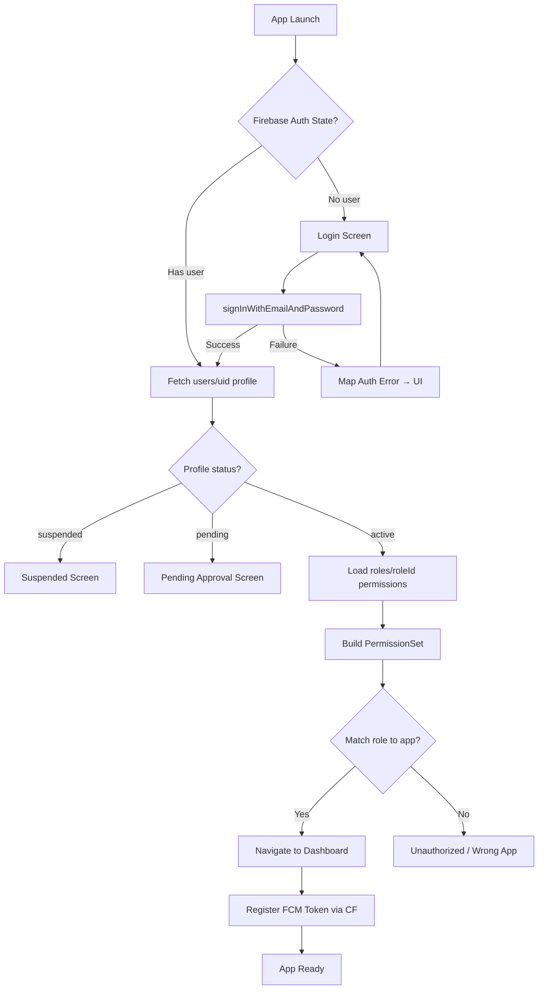
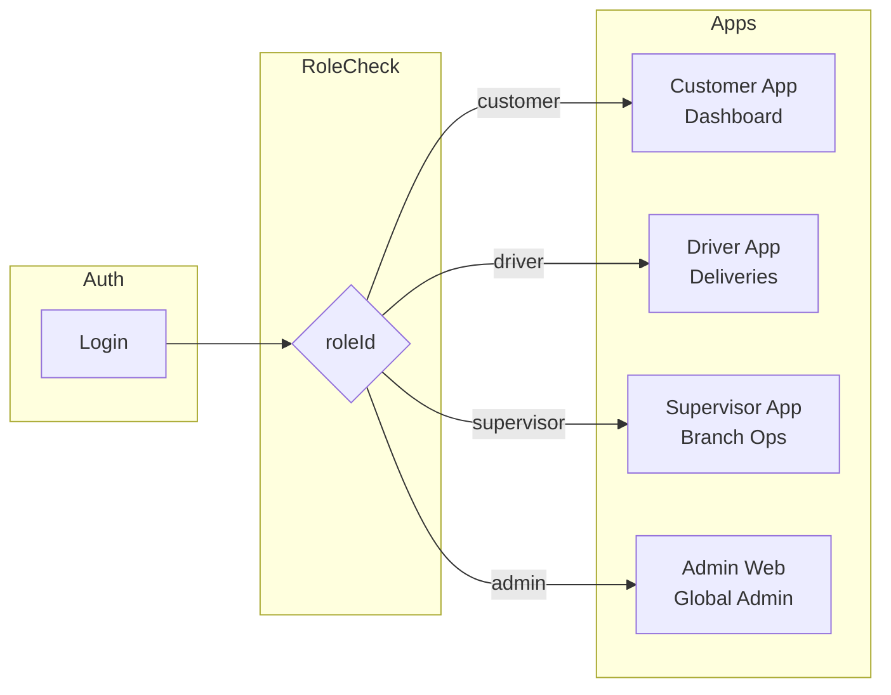
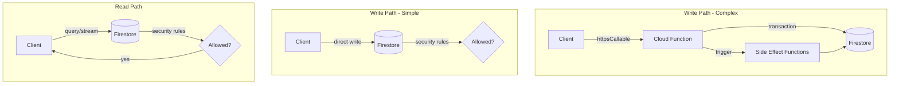
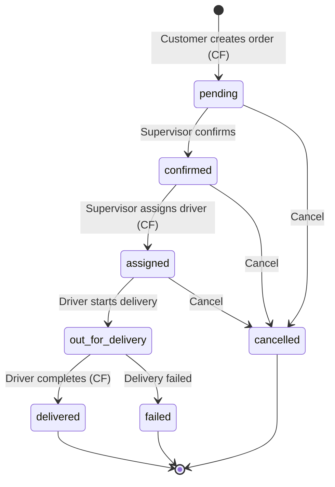
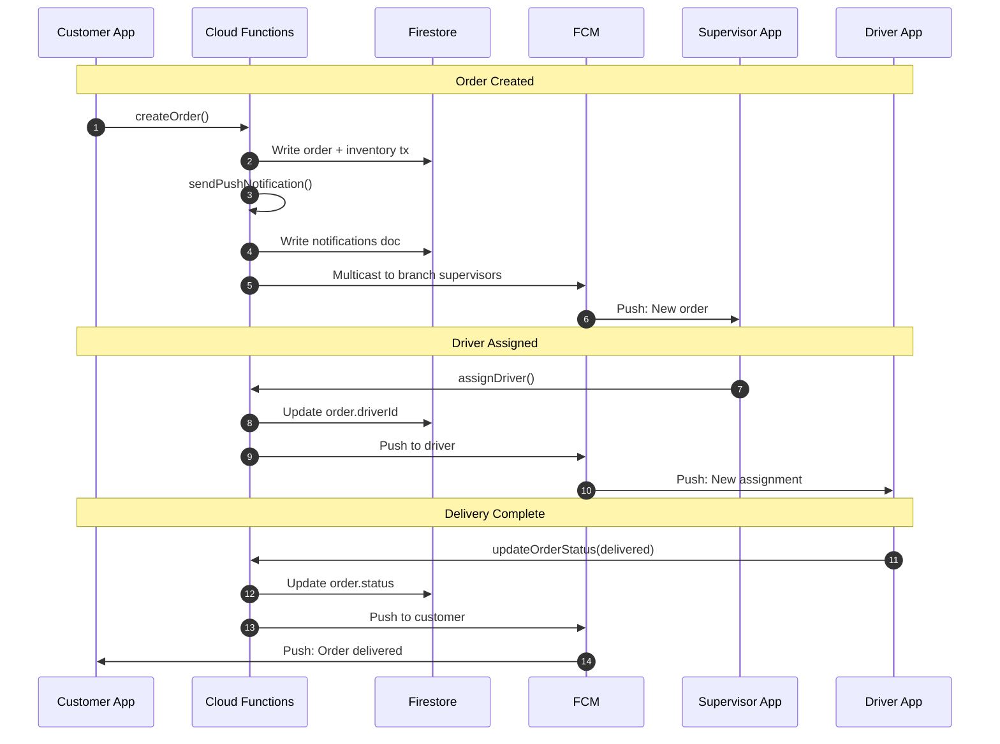
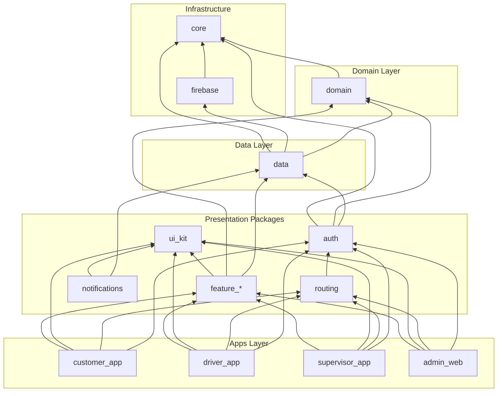
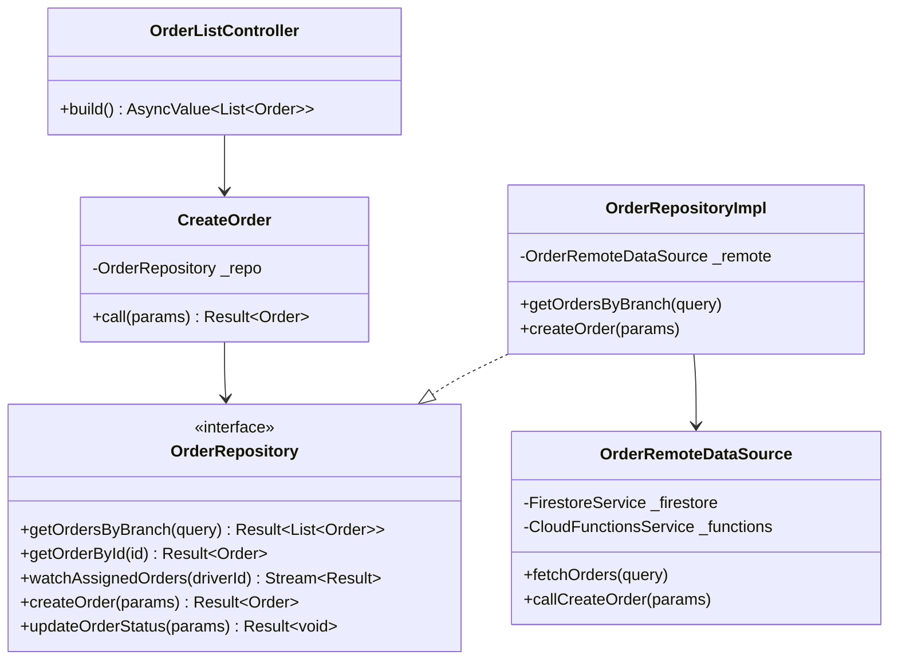
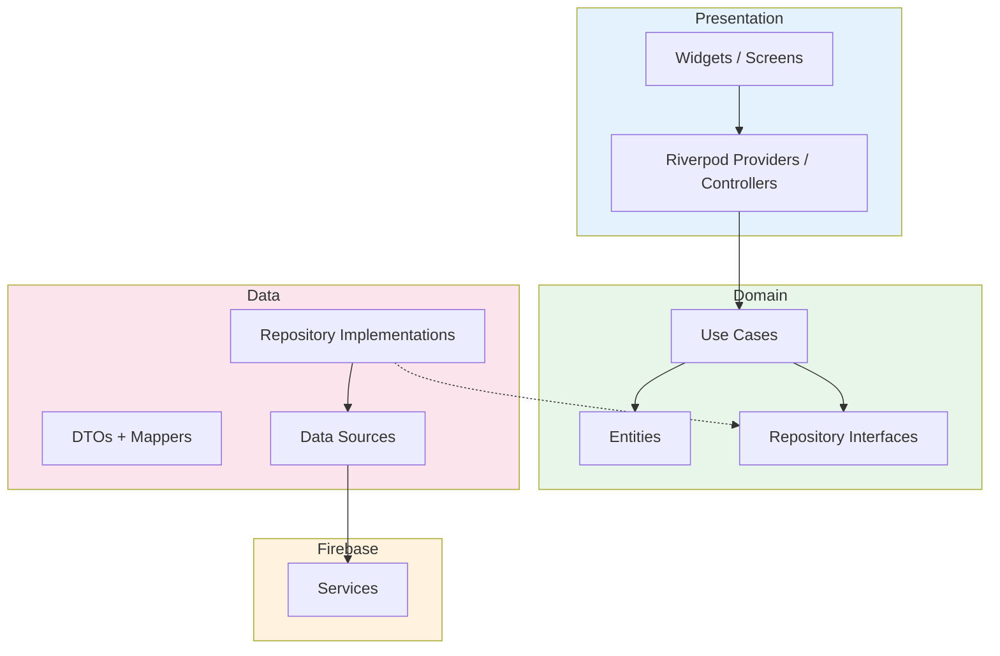
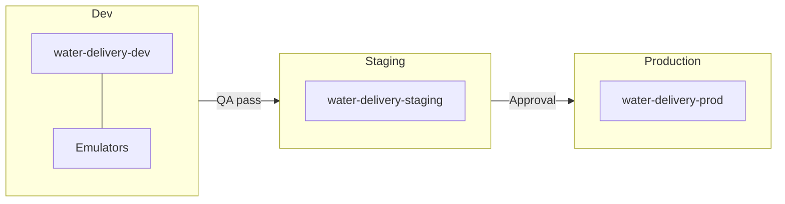
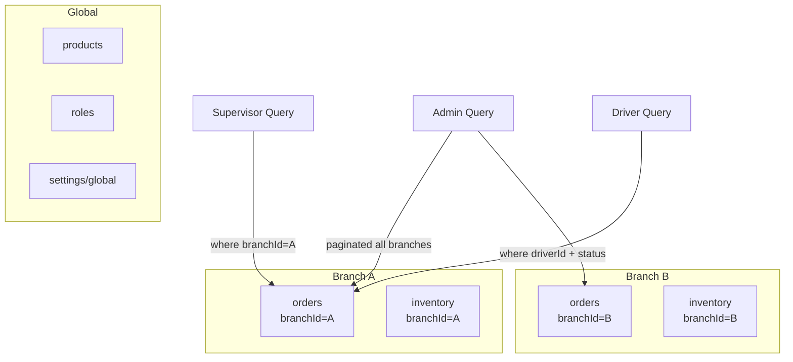

# Architecture Diagrams

Visual reference for authentication, data flow, notifications, and dependency graphs.

---

## 1. Authentication Flow

---

## 2. Role-Based App Routing

---

## 3. Firestore Data Flow

---

## 4. Order Lifecycle

---

## 5. Notification Flow

---

## 6. Dependency Graph

---

## 7. Repository Pattern

---

## 8. Clean Architecture Layers

---

## 9. Environment Deployment

---

## 10. Scalability — Branch Partitioning

